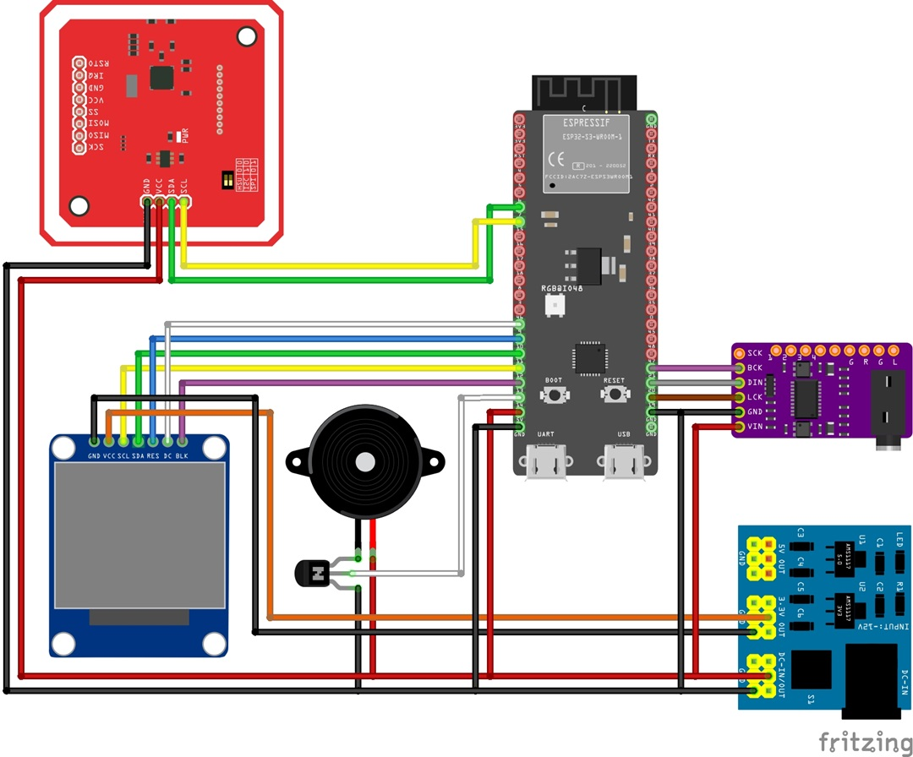
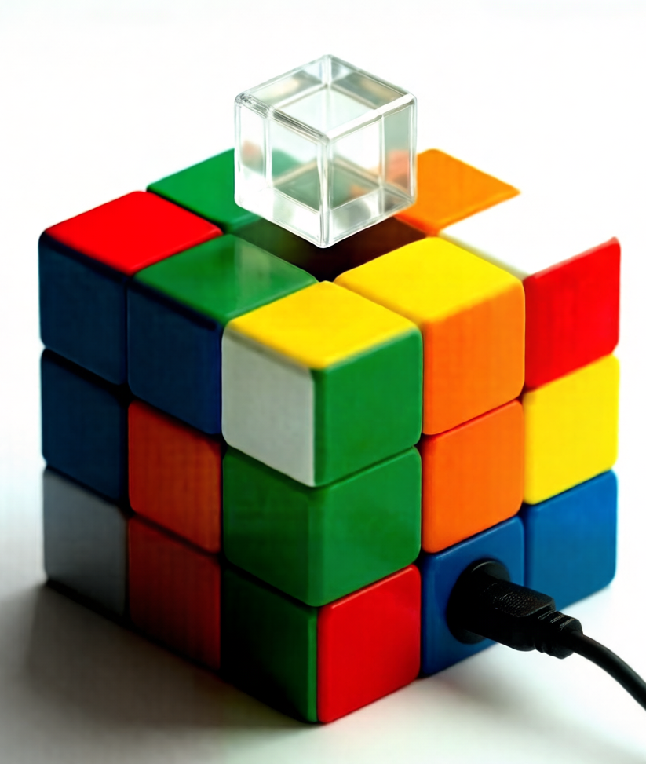

# ha-music-cube 🧊

> An ESPHome-based Media Player for Home Assistant, elegantly housed in a magic cube design with Hi-Fi audio output, small screen and NFC interaction.

## The Story Behind the Concept (Project Origin)

The birth of **ha-music-cube** wasn't a single event, but rather a fascinating evolution of "functional stacking" and design breakthroughs.

### 1. From Simple Audio to Module Integration
In the beginning, my goal was pure and simple: use an **ESP32-S3-DevkitC-1** paired with a **PCM5102A DAC** to build a high-quality Media Player. 

Before diving into the main build, I prototyped several standalone **NFC Tag Readers**. This sparked a "Eureka" moment: *If I'm already using NFC tags to trigger music, why not integrate the reader directly into the media player?* Thus, the **PN532** module joined the project, enabling physical, tactile interaction for music playback.

### 2. The Visual Awakening
Music is great, but seeing the album art makes it better. It will be cool to add a screen, isn't it? While searching for display modules, I stumbled upon a **"Holo Cube"** project online. The industrial beauty of it was mesmerizing. After comparing dimensions, I found that a **1.3-inch TFT color screen** paired with a **25.4mm Beam Splitter Cube (Prism)** was a match made in perfectly aligned dimensions for a holographic-like effect.

### 3. Engineering Challenges: Power & Feedback
As the module count grew, I realized that the **ESP32-S3's** onboard regulator could no longer handle the load. To ensure system stability and audio purity, I introduced a dedicated **Power Distribution Board**, establishing a rigorous **Star-Grounding** architecture for all modules.

Finally, drawing from my Tag Reader experience, I added a small **Active Buzzer** for haptic/audio feedback (like successful card scans), while the onboard LED of the ESP32 was repurposed as a status indicator.

### 4. The "Cube" Realization
The most exciting part was the enclosure design. As the internal components multiplied, the case size began to balloon. Suddenly, I had a flash of inspiration: the prism is a cube, so why not make the entire device a **3x3x3 Cube**? 

By using **25.4mm** (the prism's edge length) as the unit size for each "block," the resulting magic cube dimensions perfectly accommodated all modules. It was a mathematical and aesthetic win.

---

## 🎨 Design Blueprints

### Circuit Logic Diagram

  

### AI-Rendered Concept Art

  

> **Note:** This project is currently in the prototype/WIP stage. More technical documentation, schematics, and implementation details will be updated as I successfully finalize the assembly.

---
